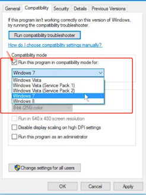

# saods-cli

The _SAO Data Store Command Line Interface (CLI)_ is a golang application for terminal-based [SAO Data Store] workflows.

Follow the [instruction](https://github.com/SaoNetwork/Data-Store-Guide/blob/main/README.md#authenticate-requests) to get your first application and use CLI to store your first file on the platform with a series of simple CLI commands.

# Getting Started

CLI users and developers must both follow these steps to get the application and running:

## Download bin
Currently, CLI is supported on the following platforms, please choose your bin file:

[windows](https://github.com/SaoNetwork/sao-cli/releases/download/v1.0.0/saods.exe)
(If you are not able to run the cli, try to change it to compatibility mode for Windows 7)



[linux](https://github.com/SaoNetwork/sao-cli/releases/download/v1.0.0/saods)

[darwin](https://github.com/SaoNetwork/sao-cli/releases/download/v1.0.0/saods-darwin)


## Set environment
you can save your appId and apiKey in config file, so that you don't need to set the parameters everytime
```shell
./saods config --appId myAppId --apiKey myApiKey
```

## Using the CLI

Learn to use any command:

```shell
./saods --help
```
```shell
./saods addFile --help
```
```shell
./saods getFile --help
```
```shell
./saods listFiles --help
```

Here are the examples to add file, get file and list files:
```shell
./saods addFile --localPath /path/to/my/file --appId myAppId --apiKey myApiKey --pretty
{
    "code":"200",
    "data":{
        "ID":1,
        "createdAt":"2022-06-21T14:29:31.689Z",
        "updatedAt":"2022-06-21T14:29:31.689Z",
        "appId":"myAppId",
        "filename":"file",
        "contentType":"application/octet-stream",
        "size":317,
        "ipfsHash":"QmNwB9iCjTwvAS3WjRe1EJzt5E4f966TQGPaNXdCPVCd2b",
        "cid":"",
        "storageProvider":""
    },
    "message":"ok",
    "timestamp":1655821771714
}

./saods getFile --hash myHash --appId myAppId --apiKey myApiKey
--respond with file content

./saods listFiles --appId myAppId --apiKey myApiKey --pretty
{
    "data": [
        {
            "id": "1",
            "filename": "file",
            "format": "application/octet-stream",
            "size": 317,
            "lastModifiedAt": 1655455241881,
            "createdAt": 1655455241881,
            "cid": "",
            "ipfsHash": "QmNwB9iCjTwvAS3WjRe1EJzt5E4f966TQGPaNXdCPVCd2b",
            "storageProvider": "",
            "appId": "myAppId"
        }
    ],
    "code": "200",
    "timestamp": 1655948182072,
    "msg": "ok"
}

```
